# Mumble 用户认证登录时序图

本文档基于 Go 代码实现 (`shitspeak.go`) 和官方 Mumble 客户端代码分析得出。

## 完整时序图

```mermaid
sequenceDiagram
    participant Client as Mumble客户端
    participant Server as 服务器
    participant Auth as 认证服务
    
    Note over Client,Server: 1. TCP连接建立
    Client->>Server: TCP连接 (TLS握手)
    Server->>Client: TLS握手完成
    
    Note over Client,Server: 2. 版本交换阶段
    Server->>Client: Version消息 (服务器版本信息)
    Note right of Server: 包含: version, release, os, os_version
    Client->>Server: Version消息 (客户端版本信息)
    Note left of Client: 包含: version, release, os, os_version
    
    Note over Client,Server: 3. 认证阶段
    Client->>Server: Authenticate消息
    Note left of Client: 包含:<br/>- username<br/>- password<br/>- tokens<br/>- celt_versions<br/>- opus支持
    
    Server->>Server: 验证用户名格式
    Server->>Server: 检查客户端状态
    
    alt 使用离线缓存
        Server->>Server: 查询本地用户缓存
    else 在线认证
        Server->>Auth: 发送认证请求
        Auth-->>Server: 返回认证结果
        Note right of Auth: status, userId,<br/>nickname, groups
    end
    
    alt 认证失败 (status = -3)
        Server->>Client: Reject (AuthenticatorFail)
        Note over Client,Server: 连接终止
    else 用户不存在 (status = -2)
        alt 允许访客
            Server->>Server: 作为访客继续
        else 不允许访客
            Server->>Client: Reject (InvalidUsername)
            Note over Client,Server: 连接终止
        end
    else 密码错误 (status = -1)
        Server->>Client: Reject (WrongUserPW)
        Note over Client,Server: 连接终止
    else 认证成功 (status >= 0)
        Server->>Server: 设置用户ID和组
    end
    
    Note over Server: 4. 认证后验证
    Server->>Server: 检查是否需要证书
    Server->>Server: 检查必需的用户组
    Server->>Server: 检查多重登录限制
    
    Note over Client,Server: 5. 加密设置阶段
    Server->>Server: 生成加密密钥 (OCB2-AES128)
    Server->>Client: CryptSetup消息
    Note right of Server: 包含:<br/>- key (16 bytes)<br/>- client_nonce<br/>- server_nonce
    
    Note over Client,Server: 6. 编码器版本协商
    Server->>Server: 更新服务器编码器版本
    Server->>Client: CodecVersion消息
    Note right of Server: 包含:<br/>- alpha (CELT版本)<br/>- beta (CELT版本)<br/>- prefer_alpha<br/>- opus支持
    
    Note over Client,Server: 7. 频道树同步
    Server->>Server: 标记客户端为已认证状态
    loop 每个频道
        Server->>Client: ChannelState消息
        Note right of Server: 包含:<br/>- channel_id<br/>- parent<br/>- name<br/>- description<br/>等
    end
    
    Server->>Client: ChannelState消息 (频道链接信息)
    
    Note over Client,Server: 8. 用户列表同步
    loop 每个已连接用户
        Server->>Client: UserState消息
        Note right of Server: 包含:<br/>- session<br/>- name<br/>- channel_id<br/>- user_id<br/>等
    end
    
    Note over Client,Server: 9. 频道分配
    Server->>Server: 确定用户默认频道
    Note right of Server: 优先使用:<br/>1. 上次频道 (注册用户)<br/>2. 默认频道 (根频道)
    
    Server->>Server: userEnterChannel()
    Server->>Client: UserState消息 (新用户自己的状态)
    Server->>+Client: 广播UserState给所有用户
    Note right of Server: has_full_user_list=true<br/>的用户才会收到广播
    
    Note over Client,Server: 10. ServerSync - 同步完成
    Server->>Client: ServerSync消息
    Note right of Server: 包含:<br/>- session (会话ID)<br/>- max_bandwidth<br/>- welcome_text<br/>- permissions (根频道权限)
    
    Note over Client,Server: 11. 服务器配置
    Server->>Client: ServerConfig消息
    Note right of Server: 包含:<br/>- allow_html<br/>- message_length<br/>- image_message_length<br/>- max_users
    
    Note over Client,Server: 12. 可选：建议配置
    opt 有建议配置
        Server->>Client: SuggestConfig消息
        Note right of Server: 包含:<br/>- version<br/>- positional<br/>- push_to_talk
    end
    
    Note over Client,Server: 13. 可选：频道权限信息
    opt 发送权限信息
        loop 每个频道
            Server->>Client: ChannelState (权限信息)
            Note right of Server: 包含:<br/>- is_enter_restricted<br/>- can_enter
        end
    end
    
    Note over Client,Server: 14. 客户端准备就绪
    Client->>Client: 标记为已同步 (synchronized)
    Note left of Client: Global::uiSession 已设置<br/>客户端现在可以:<br/>- 发送语音<br/>- 发送文本消息<br/>- 切换频道<br/>等操作
    
    Note over Client,Server: 15. 保持连接 - Ping
    loop 每30秒
        Client->>Server: Ping消息
        Server->>Client: Ping消息 (带统计信息)
    end
```



## 关键状态转换

### 服务器端客户端状态机

```
StateClientConnected          (0) - TCP连接建立
    ↓
StateServerSentVersion        (1) - 服务器发送Version
    ↓
StateClientSentVersion        (2) - 客户端发送Version
    ↓
StateClientAuthenticated      (3) - 认证成功
    ↓
StateClientReady              (4) - 同步完成，可以通信
    ↓
StateClientDead               (5) - 连接断开
```

### 客户端状态

```
Connected (等待ServerSync)
    ↓
ServerSync received (Global::uiSession 设置)
    ↓
Synchronized (可以正常通信)
```

## 消息类型定义

根据 `Mumble.proto`，消息类型编号：

```
MessageVersion         = 0
MessageUDPTunnel       = 1
MessageAuthenticate    = 2
MessagePing            = 3
MessageReject          = 4
MessageServerSync      = 5
MessageChannelRemove   = 6
MessageChannelState    = 7
MessageUserRemove      = 8
MessageUserState       = 9
MessageBanList         = 10
MessageTextMessage     = 11
MessagePermissionDenied= 12
MessageACL             = 13
MessageQueryUsers      = 14
MessageCryptSetup      = 15
MessageContextActionModify = 16
MessageContextAction   = 17
MessageUserList        = 18
MessageVoiceTarget     = 19
MessagePermissionQuery = 20
MessageCodecVersion    = 21
MessageUserStats       = 22
MessageRequestBlob     = 23
MessageServerConfig    = 24
MessageSuggestConfig   = 25
```

## 认证流程详细说明

### 1. Version 消息

**服务器发送：**
- 在 `StateClientConnected` 状态立即发送
- 可选字段：version (协议版本), release, os, os_version
- 配置控制：`SendVersion`, `SendBuildInfo`

**客户端发送：**
- 包含客户端信息用于识别和兼容性检查
- 服务器会检查 `MinClientVersion` 配置

### 2. Authenticate 消息处理

#### 2.1 用户名验证
```go
if auth.Username == nil || len(*auth.Username) == 0 {
    client.RejectAuth(mumbleproto.Reject_InvalidUsername, ...)
}
```

#### 2.2 认证服务调用
```go
status, userId, nickname, groups, err := server.Authenticate(
    username, password, certHash, sessionId, ip, 
    version, clientName, osName, osVersion
)
```

**认证状态码：**
- `-3`: 服务器问题 (AuthenticatorFail)
- `-2`: 用户不存在 (InvalidUsername 或允许访客)
- `-1`: 密码错误 (WrongUserPW)
- `>= 0`: 认证成功，返回userId

#### 2.3 认证后检查

**证书检查：**
```go
if server.cfg.CertRequired {
    if client.IsRegistered() && !client.HasCertificate() {
        client.RejectAuth(mumbleproto.Reject_NoCertificate, ...)
    }
}
```

**必需组检查：**
- 支持 OR 和 AND 组合逻辑
- `RequiredGroup` 配置项

**多重登录检查：**
- `MultiLoginLimitSameIP`: 是否限制同IP多重登录
- `MaxMultipleLoginCount`: 最大同时登录数量

### 3. CryptSetup 消息

生成 16 字节的密钥和 nonce：
```go
err = client.crypt.GenerateKey(client.CryptoMode)
client.sendMessage(&mumbleproto.CryptSetup{
    Key:         client.crypt.Key,
    ClientNonce: client.crypt.DecryptIV,
    ServerNonce: client.crypt.EncryptIV,
})
```

加密模式：`OCB2-AES128`

### 4. CodecVersion 协商

服务器会更新所有客户端的编码器版本以确保兼容性：
```go
server.updateCodecVersions(client)
```

### 5. 频道树发送

**两个阶段：**
1. 发送所有频道基本信息（不含parent）
2. 发送频道层级关系（parent字段）

这样做是为了确保客户端能正确构建频道树。

### 6. 用户列表发送

只发送已认证且未断开的其他用户：
```go
connectedClients := server.clients.SnapshotWithFilter(
    func(k uint32, c *Client) bool {
        return c.state >= StateClientAuthenticated && 
               c.state < StateClientDead && 
               client != c
    }, 1)
```

### 7. ServerSync 消息

**关键字段：**
- `session`: 客户端的会话ID（唯一标识符）
- `max_bandwidth`: 允许的最大带宽
- `welcome_text`: 欢迎消息
- `permissions`: 根频道的权限位掩码

**客户端行为：**
收到此消息后，客户端将：
- 设置 `Global::uiSession`
- 标记为已同步 (synchronized)
- 触发 `serverSynchronized` 信号
- 开始发送 UDP ping 建立语音连接

### 8. ServerConfig 消息

服务器配置信息，影响客户端行为：
- `allow_html`: 是否允许HTML格式文本
- `message_length`: 文本消息最大长度
- `image_message_length`: 图片消息最大长度
- `max_users`: 服务器最大用户数

## Node 代码需要改进的地方

基于以上分析，Node 代码 (`edge-server.ts`) 需要以下改进：

### 1. 消息发送顺序

**当前顺序可能有问题**，应该严格按照以下顺序：

1. ✅ CryptSetup
2. ✅ CodecVersion  
3. ✅ ServerConfig （当前在 handleAuthSuccess 中）
4. ✅ 频道树 (sendChannelTree)
5. ✅ 用户列表 (sendUserListToClient)
6. ✅ 新用户的 UserState (广播给所有人)
7. ❌ **缺失：ServerSync** - 这是关键消息！
8. ✅ SuggestConfig (可选)
9. ✅ 频道权限 (可选)

### 2. ServerSync 消息缺失

**问题：** Node 代码没有发送 ServerSync 消息！

**ServerSync 是标志同步完成的关键消息**，客户端收到这个消息后才会：
- 设置会话ID
- 标记为已同步
- 开始发送语音数据
- 允许用户交互

### 3. 状态管理

Go 代码有清晰的状态机：
```go
StateClientConnected → StateServerSentVersion → 
StateClientSentVersion → StateClientAuthenticated → StateClientReady
```

Node 代码需要实现类似的状态管理。

### 4. 频道分配逻辑

Go 代码的逻辑：
1. 对于注册用户，尝试获取上次的频道
2. 检查频道权限（如果配置要求）
3. 回退到默认频道

Node 代码需要实现完整的上次频道记忆功能。

### 5. 广播范围

Go 代码的广播逻辑：
```go
server.broadcastProtoMessageWithPredicate(userstate, func(c *Client) bool {
    return c == client || c.hasFullUserList
})
```

只有 `has_full_user_list=true` 的客户端才会收到新用户广播，Node 代码也需要这个逻辑。

### 6. 多重登录检查

Node 代码需要实现：
- 检查同一用户的多个连接
- 同IP限制（如果配置）
- 最大登录数量限制

## 实现建议

### 优先级 1 - 必须修复

1. **添加 ServerSync 消息发送**
   - 在所有同步消息之后
   - 在 UserState 广播之后
   - 包含正确的 session, max_bandwidth, welcome_text, permissions

2. **修复消息发送顺序**
   - 严格按照上述顺序
   - ServerSync 必须是同步完成的标志

### 优先级 2 - 重要改进

3. **实现状态机管理**
   - 定义清晰的客户端状态
   - 在状态转换时做相应检查

4. **完善广播逻辑**
   - 只向 has_full_user_list 的客户端广播
   - 正确处理 actor 字段

### 优先级 3 - 功能完善

5. **上次频道记忆**
   - 存储注册用户的上次频道
   - 恢复时检查权限

6. **多重登录控制**
   - 实现多重登录限制
   - 同IP检查

## 参考文档

- [Mumble Protocol Documentation](https://mumble-protocol.readthedocs.io/)
- [Establishing Connection](https://github.com/mumble-voip/mumble/blob/master/docs/dev/network-protocol/establishing_connection.md)
- `Mumble.proto` - Protocol Buffer 定义文件
